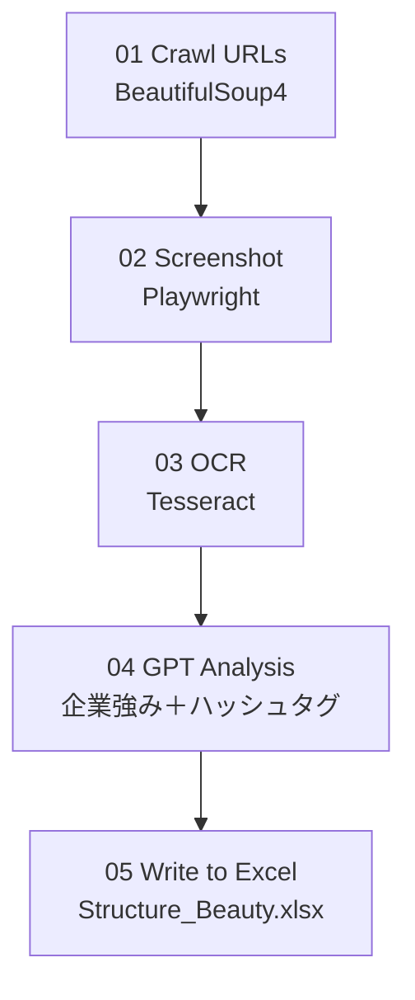

# Workflow Diagram



💡 **ポイント**  
- これは GitHub 上で自動的に「矢印付きのフローチャート」として描画されます。  
- これを `docs/flow.md` にしておくと、READMEをスッキリ保ったままワークフローを別ページで見せられます。  

---

## （４）⚙️ requirements.txt  
> 「このプロジェクトを動かすために必要なPythonパッケージを一覧にする」

### 🎯 目的  
- 誰が見ても「どんなライブラリを使っているか」がわかる。  
- ほかの人（採用担当・技術者）が簡単に再現できる。  

### 💪 あなたがやること
1️⃣ `website-analysis-pipeline/` の直下に `requirements.txt` を作る。  
2️⃣ 次の内容をコピペして保存👇  

```txt
beautifulsoup4
requests
lxml
pandas
openpyxl
tqdm```
playwright
Pillow
pytesseract
opencv-python
python-dotenv
